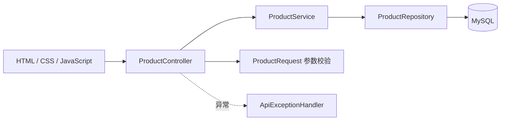

# 架构与设计

## 请求处理流程

Controller 负责请求参数和 HTTP 状态；Service 管理商品业务与事务；Repository 使用 Spring Data JPA 访问数据库。DTO 与持久化实体分开，避免请求直接修改主键。

## 数据模型

| 字段 | 数据类型 | 约束 |
| --- | --- | --- |
| id | BIGINT | 自增主键 |
| name | VARCHAR(100) | 必填，保存前去除首尾空格 |
| price | DECIMAL(12,2) | 非负，使用 BigDecimal 表示金额 |
| stock | INTEGER | 非负，最大 2147483647 |
| description | VARCHAR(1000) | 可选 |

查询按 ID 倒序，名称支持忽略大小写的包含查询。分页页码从 0 开始，每页 1–100 条。更新和删除先检查记录，不存在返回 404。

## 前端职责

- `static/index.html`：页面语义结构、弹窗和 SVG 图标。
- `static/css/app.css`：主题、布局、窄屏适配、焦点状态。
- `static/js/app.js`：API 请求、DOM 渲染、分页和弹窗交互。

商品名称与描述通过 `textContent` 写入页面；列表请求用递增标识避免较旧搜索结果覆盖新结果；保存和删除过程中禁用重复提交。库存统计明确限定为当前页；库存 1–10 件显示偏低，0 件显示无库存。

## 配置及边界

数据源支持 `MYSQL_URL`、`MYSQL_USERNAME`、`MYSQL_PASSWORD` 环境变量。启动脚本交互式接收密码；不保存真实凭据。`.env` 不会自动加载。

为简化本地运行，采用 `ddl-auto=update` 自动建表。作品后续可增加数据库迁移、认证与角色权限、乐观锁及数据库集成测试。当前没有并发编辑冲突检测，最后一次成功保存会覆盖前一次编辑。
